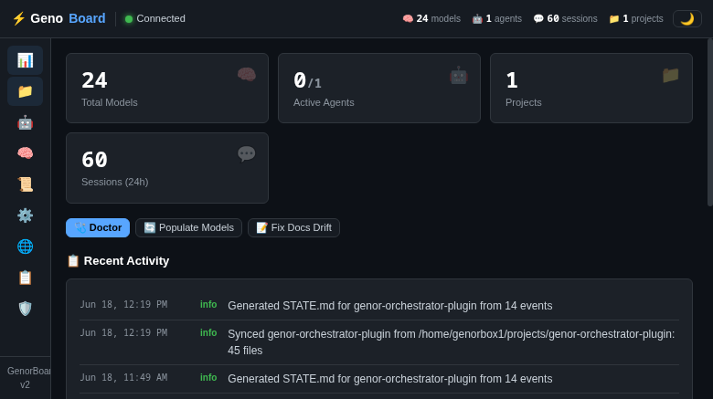
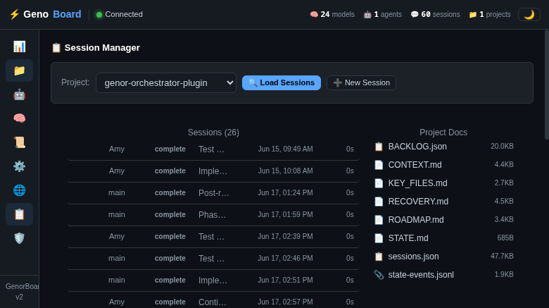
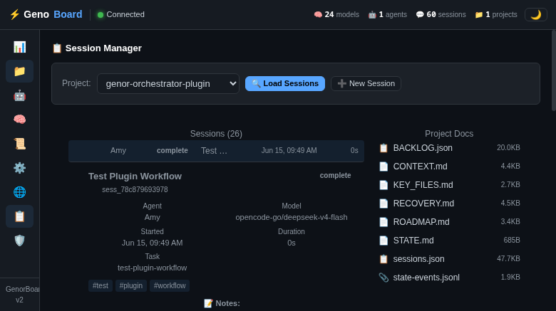
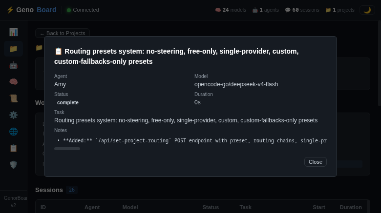

# Genor's Orchestrator — OpenClaw Plugin

[](https://clawhub.com/packages/genor-orchestrator-plugin)
[](LICENSE)
[](https://github.com/GenorTG/genor-orchestrator-plugin/releases)


> **✨ 47 tools + 7 lifecycle hooks that turn OpenClaw into an AI-powered project orchestration powerhouse.** Model routing with 5 routing presets, session logging, backlog management, live agent tracking, active-project binding, context injection, ADR management, workflow phase enforcement, QA review cycles, a built-in dashboard — all inside OpenClaw with zero external processes.

The orchestrator doesn't take over your thinking. It handles the scaffolding so your LLM can focus on what matters: **coding, solving problems, and building cool stuff.** 🚀

---

## 🚀 What's New in v0.9.1

| # | Feature | What It Does |
|---|---------|-------------|
| 🔍 | **Full Code Audit** | Complete P0–P2 audit of all 15k+ lines across 70+ files. Fixed 5 P0 data integrity issues (silent catches, migration versioning, FK constraints, timestamp normalization, column allowlists), 5 P1 code quality issues (TOOL_METADATA dedup, audit logging, LIMIT on queries, advance_phase decomposition, backlog dispatch extraction), and 5 P2 issues (race conditions, per-session state, error shape unification, gateway token extraction, dashboard refreshAll fix). See [`AUDIT.md`](./AUDIT.md). |
| 🧹 | **TOOL_METADATA Dedup** | `api.registerTool` now auto-collects metadata — removed 260 lines of drift-prone duplicate JSON. |
| 🔒 | **Per-Session State** | SessionTracker stores per-session data in isolated `SessionState` objects instead of shared singletons. |
| 📝 | **Audit Logging** | All 10 dashboard mutation endpoints now write audit log entries. |

### v0.9.0

| # | Feature | What It Does |
|---|---------|-------------|
| 🚀 | **OpenAI Endpoint Session Spawn** | Dashboard **➕ New Session** button spawns persistent sessions by POSTing directly to the gateway's OpenAI-compatible `/v1/chat/completions` endpoint with a custom `x-openclaw-session-key` header. No queue files, no cron, no subagent.run() bridging. The new session starts immediately and auto-registers on `session_start`. |
| 🧹 | **Queue Approach Removed** | The old `pending-spawns.json` → `before_prompt_build` hook → `subagent.run()` pipeline has been removed entirely. Session spawns now use a direct, synchronous OpenAI endpoint call. |
| 📋 | **Dashboard Spawn Button** | Click ➕ New Session in the dashboard, choose a project, describe the task, and optionally pick a model. An instant session is created via the gateway's own API with the session key returned immediately. |
| 🔧 | **Simplified Architecture** | Removed `trusted-operator`, self-API fetch, heartbeat, and cron-based spawn approaches. The OpenAI endpoint spawn is the only path — proven through end-to-end testing. |

### v0.8.0

The jump from 28 → 40 tools brings a **complete dashboard redesign**, a new **Sessions tab**, and **12 new tools** for project lifecycle and QA:

| # | Feature | What It Does |
|---|---------|-------------|
| 🖥️ | **Dashboard Redesign** | 1428-line single-file SPA with 9-tab left sidebar nav, StateManager reactive state, lazy rendering, toast notifications, accessible ARIA roles. Replaced old top-tab-bar with clean sidebar layout. |
| 📋 | **Sessions Tab** | Per-project session tree with parent-child hierarchy, clickable detail pane, spawn sub-agent modal. Replaces old "Chat Console" (all SSE/chat functionality removed — that's OpenClaw WebUI's job). |
| ✅ | **QA Workflow** | 3 new tools: `qa_submit`, `qa_approve`, `qa_reject`. Auto-spawns independent QA review subagent on submit. QA gate blocks work→log phase transition. |
| 🤝 | **Handoff & Deep-Dive** | `generate_handoff` — compact session handoff for agent switching. `grill_with_docs` — subagent that quizzes you on project docs to sharpen understanding. |
| 🧹 | **Doc Tools** | `fix_docs_drift` — scans for stale version numbers, tool counts, etc. `regenerate_state` — STATE.md from state event log. `cleanup_docs` — spawns subagent to fix broken links, stale content. |
| 🧪 | **Test Infrastructure** | `setup_unit_tests` and `setup_e2e_tests` — spawn subagents with framework config + initial tests. `debug_issue` and `create_functionality` — spawn subagents for targeted work. |
| 🐛 | **Bug Fixes** | Dashboard handler rebuild on every plugin load, stale model display in dashboard, orphan session key cleanup, auto-populate edge cases. |

### v0.7.0

| # | Feature | What It Does |
|---|---------|-------------|
| 🧠 | **Routing Presets** | 5 presets: Custom Chains, No Steering, Free Only, Single Provider, Custom Fallbacks Only. Dashboard preset selector with live descriptions. Dynamic provider input for Single Provider mode. |
| 📋 | **Backlog Tools** | 6 tools: `backlog_add`, `backlog_list`, `backlog_update`, `backlog_dispatch`, `backlog_dispatch_all`, `create_project`. Full project backlog CRUD with dependency resolution and parallel dispatch. |
| 🔗 | **Routing Chains** | Per-task-type (coding, fixing, research, q&a, documentation) model preference lists with fallback chain. Dashboard-editable, persisted to config. |
| 🧩 | **Enhanced Routing Brain** | `get_routing` returns model quality metadata (tier, speed, context, status). Task category auto-inferred from task description. Blocked chain detection. Preset-aware hook resolution with chain fallthrough logic. |
| 🖥️ | **Dashboard Agent Cards** | Stop and Recover buttons on agent cards. Safeguards tab with event log viewer, agent health indicators (healthy/warning/stale). |
| 🛡️ | **Safeguards Dashboard** | Configuration card, workflow enforcement per project, agent phase display, phase timeline, safeguard event log. |

---

## 📋 Quick Start

### For AI Agents

> **Copy-paste to any AI agent:** *"Install Genor's Orchestrator from https://github.com/GenorTG/genor-orchestrator-plugin.git"*

The agent will:
1. `git clone --recurse-submodules` the repo
2. Read `SETUP.md`
3. Execute the installation procedure

Done. The plugin auto-creates data dirs, schedules nightly model sync, and runs background maintenance every 30 minutes. ⏰

### Via ClawHub

```bash
clawhub package install genor-orchestrator-plugin
```

### From Source

```bash
git clone --recurse-submodules https://github.com/GenorTG/genor-orchestrator-plugin.git
cd genor-orchestrator-plugin
npm install
npm run plugin:build
```

Then add `genor-orchestrator-plugin` to your OpenClaw `plugins.load.paths` config and restart.

### ⚙️ Configuration Requirements

> **No manual OpenClaw config changes needed.** The plugin handles everything internally.

The dashboard's **➕ New Session** button spawns persistent project sessions using a **direct OpenAI endpoint call**:

1. The dashboard handler reads the gateway auth token from `~/.openclaw/openclaw.json` (or `OPENCLAW_GATEWAY_TOKEN` env var)
2. It generates a unique session key and POSTs to the gateway's own OpenAI-compatible endpoint: `POST http://127.0.0.1:18789/v1/chat/completions`
3. The request includes:
   - `Authorization: Bearer {gatewayToken}` — authenticates the dashboard as a trusted client
   - `x-openclaw-session-key: {custom key}` — assigns a deterministic session key for the new session
   - `x-openclaw-model: {model}` — (optional) picks the model for the new session
   - The message body tells the spawned session to auto-register with the orchestrator project
4. The new session starts almost instantly. Its `session_start` hook auto-detects the project spawn context and registers with the orchestrator
5. The spawned session appears in the dashboard's **Live Agents** with full project context

**What this means for you:**
1. The plugin must be in your `plugins.allow` list (it is by default when installed via ClawHub or `plugin:build`)
2. The gateway's auth token must be readable from `~/.openclaw/openclaw.json` (standard for gateway installations)
3. That's it — no config tokens, no file paths, no special permissions to set up
4. The spawn API returns the session key immediately; the session starts right away

**Why this approach:** Direct OpenAI endpoint calls are the simplest and most reliable way to create new sessions in OpenClaw. The `x-openclaw-session-key` header gives us deterministic session key assignment, and the `session_start` hook handles auto-registration. No queue files to manage, no hook bridging, no cron-based polling.

**What was abandoned:**
- ❌ Queue-based spawn (`pending-spawns.json` → `before_prompt_build` → `subagent.run()`) — Removed in v0.9.0. Too complex, fragile under race conditions.
- ❌ `gatewayRuntimeScopeSurface: "trusted-operator"` — Doesn't work with `auth: "plugin"` routes. The runtime ignores it for plugin-authenticated routes.
- ❌ Self-API fetch to `/v1/chat/completions` via `fetch()` from hook context — Blocks for 10-30s waiting for AI response, and `session_start` hook doesn't fire predictably for API-created sessions in some configuration.
- ❌ `requestHeartbeat` — Doesn't trigger `before_prompt_build` hook. Heartbeats check for pending work but don't create agent turns.
- ❌ Cron jobs — User explicitly rejected cron-based triggers.

### Sanity Check

```bash
# Check the dashboard is live
openclaw curl /orchestrator/status

# Verify the plugin loaded
openclaw plugins list | grep orchestrator
```

---

## 🔧 Tool Reference

Every tool is registered with full metadata for OpenClaw agent injection — AI agents see these as first-class tools in their tool belt. Here they all are, all **47** of them:

### 📋 Registration & Lifecycle

#### `orchestrator_register`
> 🎟️ **Opt in to orchestrator tracking.** Required first step before anything else.

```typescript
orchestrator_register()
// → "registered" | "already registered"
```

| Param | Type | Required | Description |
|-------|------|----------|-------------|
| *(none)* | | | Just call it. |

**When to use:** Every time you start a new session that will do project work. No registration = the orchestrator is invisible to you.

---

#### `orchestrator_unregister`
> 🚪 **Remove this session from orchestrator tracking.** Clears project binding, context, and stops all tracking.

```typescript
orchestrator_unregister()
// → "unregistered"
```

| Param | Type | Required | Description |
|-------|------|----------|-------------|
| *(none)* | | | Just call it. |

**When to use:** When project work is complete or the session should no longer be tracked. Also cleans up stale registrations.

---

### 🎯 Context Management

#### `orchestrator_set_context`
> ⭐ **THE most important tool. Mandatory before starting project work.** Sets the active project and task, enabling auto-routing, auto-logging, and context injection. Once called, this session is **locked** to this project until `orchestrator_release_project`.

```typescript
orchestrator_set_context(
  project: "my-project",
  task: "Add delete button to settings page. Currently the settings page has no delete functionality. Requires: new DELETE route in settings.ts, confirmation dialog component, backend endpoint."
)
```

| Param | Type | Required | Description |
|-------|------|----------|-------------|
| `project` | `string` | ✅ | Project name (e.g., `kfinance`, `kotw`). |
| `task` | `string` | ✅ | What you're about to do — concise bullet list. Include what, why, and scope. |
| `original_prompt` | `string` | ❌ | The user's original request. Captured for traceability. Truncated to 500 chars. |

**When to use:** Before starting ANY project work. Calling this is the moment the orchestrator starts helping you — routing models, logging sessions, injecting project context.

---

#### `orchestrator_clear_context`
> 🧹 **Clear active project context.** Disables auto-routing and auto-logging. Note: **does NOT release the session-project binding** — use `orchestrator_release_project` for that.

```typescript
orchestrator_clear_context()
// → { ok: true, previous_project: "my-project" }
```

| Param | Type | Required | Description |
|-------|------|----------|-------------|
| *(none)* | | | Just call it. |

**When to use:** You want to stop working for now. Context is cleared but binding persists — you can `set_context` back to the same project without issues.

---

#### `orchestrator_release_project`
> 🔓 **Unlock the session-project binding.** Once released, you can `set_context` to a different project.

```typescript
orchestrator_release_project()
// → { ok: true, released_project: "my-project", message: "..." }
```

| Param | Type | Required | Description |
|-------|------|----------|-------------|
| `force` | `boolean` | ❌ | Force release even if migration in progress (default: `false`). |

**When to use:** You're done with project A and need to switch to project B. **This is the only way to unbind.**

---

### 📊 Status & Configuration

#### `orchestrator_get_status`
> 📈 **Quick overview pulse.** Model counts, session count, project list, free-only mode state.

```typescript
orchestrator_get_status()
// → { total_models: 24, active_models: 24, agent_ready_models: 11, sessions_logged: 42, projects: [...], free_only_mode: false }
```

| Param | Type | Required | Description |
|-------|------|----------|-------------|
| *(none)* | | | Just call it. |

**When to use:** Whenever you want to know the state of things at a glance.

---

#### `orchestrator_get_config`
> ⚙️ **Read the full routing configuration.** Free-only mode, disabled models, per-project allowlists, provider breakdown.

```typescript
orchestrator_get_config()
// → { free_only_mode: false, disabled_models: [], projects: [...], total_models: 24, providers: {...}, project_count: 3 }
```

| Param | Type | Required | Description |
|-------|------|----------|-------------|
| *(none)* | | | Just call it. |

**When to use:** Check what's configured before investigating model routing issues.

---

### 🤖 Model Management (5 tools)

#### `orchestrator_get_models`
> 🎯 **List and filter the model inventory.** Powerful filtering by status, provider, search, project routing, and agent-ready flag.

```typescript
orchestrator_get_models(status: "active", agent_ready: true)
// → { total: 24, filtered: 11, models: [...] }
orchestrator_get_models(project: "my-project", provider: "openai")
// → { ... filtered by project routing + provider }
```

| Param | Type | Required | Description |
|-------|------|----------|-------------|
| `status` | `string` | ❌ | Filter: `active`, `discovered`, `offline`, `removed`. Comma-separated. |
| `provider` | `string` | ❌ | Partial match on provider name. |
| `search` | `string` | ❌ | Search model ID or name. |
| `agent_ready` | `boolean` | ❌ | Filter by the agent_ready flag. |
| `project` | `string` | ❌ | Apply project routing filters to the results. |

**When to use:** Discovering what models are available, checking which are agent-ready, inspecting project-specific eligibility.

---

#### `orchestrator_check_models`
> 🔍 **Preview model eligibility** for a specific project with all routing filters applied.

```typescript
orchestrator_check_models(project: "my-project")
// → { project: "my-project", filters_applied: [...], eligible_count: 11, total_available: 24, eligible_models: [...] }
```

| Param | Type | Required | Description |
|-------|------|----------|-------------|
| `project` | `string` | ❌ | Project name for per-project routing rules. Omit for global-only check. |

**When to use:** Debug model routing — see exactly which models are eligible for a project and which filters are being applied.

---

#### `orchestrator_auto_populate`
> 🔄 **Sync model inventory from OpenClaw gateway.** Scrapes the gateway config and merges into `models.json`, preserving any manual ratings you've set.

```typescript
orchestrator_auto_populate()
// → { success: true, total_models: 24, output: "..." }
```

| Param | Type | Required | Description |
|-------|------|----------|-------------|
| *(none)* | | | Just call it. |

**When to use:** After installing new models or providers, or if the model inventory seems out of date. Auto-populates from gateway config on every boot. 🔄

---

#### `orchestrator_get_routing`
> 🧭 **Get the recommended model for a task category.** Returns ordered model list + best available model for the project + category combo.

```typescript
orchestrator_get_routing(category: "coding", project: "my-project")
// → { ok: true, recommended: "opencode-go/deepseek-v4-flash", fallbacks: [...], all: [...] }
```

| Param | Type | Required | Description |
|-------|------|----------|-------------|
| `category` | `string` | ✅ | `coding`, `fixing`, `research`, `q&a`, `documentation` |
| `project` | `string` | ❌ | Omit to use current project context. |

**When to use:** You want to pick a model explicitly based on task category rather than relying on auto-routing.

---

### 📁 Project Management (8 tools)

#### `orchestrator_create_project`
> 🏗️ **Create a new project** with STATE.md, dashboard config entry, and optional spawn marker for immediate work.

```typescript
orchestrator_create_project(
  name: "my-project",
  directory: "/home/user/projects/my-project",
  description: "A web app for managing tasks",
  spawn: true,
  spawn_task: "Set up the project structure"
)
```

| Param | Type | Required | Description |
|-------|------|----------|-------------|
| `name` | `string` | ✅ | Project name (lowercase, hyphens/underscores only). |
| `directory` | `string` | ❌ | Absolute path to the project directory on disk. |
| `description` | `string` | ❌ | Short description of what the project is for. |
| `spawn` | `boolean` | ❌ | If true, schedule an immediate isolated session for this project. |
| `spawn_task` | `string` | ❌ | Initial task description for the spawned session. |

**When to use:** Starting a new project. Creates STATE.md, dashboard config, and optionally kicks off a work session.

---

#### `orchestrator_sync_project`
> 🔗 **Sync a project's files from disk into orchestrator-data.** Regenerates `CONTEXT.md` and `KEY_FILES.md` from the project source. Requires project location to be configured in `dashboard-config.json`.

```typescript
orchestrator_sync_project(project: "my-project")
// → { ok: true, project: "my-project", location: "/home/user/projects/my-project" }
```

| Param | Type | Required | Description |
|-------|------|----------|-------------|
| `project` | `string` | ✅ | Project name to sync. |

**When to use:** After major project changes, or when you want the orchestrator to regenerate its understanding of the codebase. Also runs automatically during maintenance ticks.

---

#### `orchestrator_get_project_docs`
> 📂 **List all orchestrator-managed documents** for a project: `CONTEXT.md`, `STATE.md`, `ROADMAP.md`, `RECOVERY.md`, `sessions.json`, `BACKLOG.json`, and more.

```typescript
orchestrator_get_project_docs(project: "my-project")
// → { project: "my-project", doc_count: 7, docs: ["CONTEXT.md", "STATE.md", "RECOVERY.md", ...] }
```

| Param | Type | Required | Description |
|-------|------|----------|-------------|
| `project` | `string` | ✅ | Project name. |

**When to use:** Check what documentation exists for a project, or confirm that the required docs are generated.

---

#### `orchestrator_fix_docs_drift`
> 🔍 **Scan project documentation for stale version numbers, tool counts, test counts, and other drift.** Updates STATE.md, CONTEXT.md, ROADMAP.md, and README.md to match current project state.

```typescript
orchestrator_fix_docs_drift(project: "my-project")
// → { ok: true, fixes_applied: 3, details: [...] }
```

| Param | Type | Required | Description |
|-------|------|----------|-------------|
| `project` | `string` | ❌ | Project name. Omit to use current project context. |

**When to use:** When project docs seem out of date after significant code changes.

---

#### `orchestrator_regenerate_state`
> 🔄 **Regenerate STATE.md from the project state event log (state-events.jsonl).** No LLM involved — computed from actual events. Safe for concurrent writers.

```typescript
orchestrator_regenerate_state(project: "my-project")
// → { ok: true, project: "my-project", path: "..." }
```

| Param | Type | Required | Description |
|-------|------|----------|-------------|
| `project` | `string` | ❌ | Omit to use current project context. |

**When to use:** After STATE.md gets out of sync with the event log.

---

#### `orchestrator_cleanup_docs`
> 🧹 **Spawns a subagent that reads, cleans up, and updates project documentation** — fixing broken links, stale content, and filling gaps.

```typescript
orchestrator_cleanup_docs(scope: "all")
// → spawns a subagent, returns session key
```

| Param | Type | Required | Description |
|-------|------|----------|-------------|
| `scope` | `string` | ❌ | `all` (default), `readme`, `adrs`, `docs`, `tests`. |
| `model` | `string` | ❌ | Optional model override for the subagent. |

**When to use:** When project docs are messy and need a thorough cleanup pass.

---

### 📋 Backlog Management (6 tools)

#### `orchestrator_backlog_add`
> ➕ **Add a task to a project's backlog.** Supports priority, labels, and dependencies.

```typescript
orchestrator_backlog_add(
  project: "my-project",
  title: "Add user authentication",
  description: "Implement JWT-based login with refresh tokens",
  priority: "p1",
  labels: ["feature", "auth"],
  depends_on: ["TASK-001"]
)
// → { ok: true, id: "TASK-003", title: "Add user authentication" }
```

| Param | Type | Required | Description |
|-------|------|----------|-------------|
| `project` | `string` | ✅ | Project name. |
| `title` | `string` | ✅ | Task title. |
| `description` | `string` | ❌ | Task description. |
| `priority` | `string` | ❌ | `p0` (urgent), `p1` (high), `p2` (normal), `p3` (low). Default: `p2`. |
| `labels` | `string[]` | ❌ | Labels/tags. |
| `depends_on` | `string[]` | ❌ | Task IDs this depends on. |

**When to use:** Adding new work items to a project's backlog. The task is assigned a unique ID and persisted to `BACKLOG.json`.

---

#### `orchestrator_backlog_list`
> 📋 **List backlog tasks** with optional filters by status, priority, or label.

```typescript
orchestrator_backlog_list(project: "my-project")
orchestrator_backlog_list(project: "my-project", status: "todo", priority: "p1")
```

| Param | Type | Required | Description |
|-------|------|----------|-------------|
| `project` | `string` | ✅ | Project name. |
| `status` | `string` | ❌ | `todo`, `in_progress`, `done`, `blocked`. |
| `priority` | `string` | ❌ | `p0`, `p1`, `p2`, `p3`. |
| `label` | `string` | ❌ | Filter by label. |

**When to use:** See what's in the backlog, find tasks by state or priority.

---

#### `orchestrator_backlog_update`
> ✏️ **Update a backlog task's** status, priority, assignment, or labels.

```typescript
orchestrator_backlog_update(
  project: "my-project",
  id: "TASK-003",
  status: "in_progress",
  assigned_to: "Amy"
)
```

| Param | Type | Required | Description |
|-------|------|----------|-------------|
| `project` | `string` | ✅ | Project name. |
| `id` | `string` | ✅ | Task ID. |
| `status` | `string` | ❌ | `todo`, `in_progress`, `done`, `blocked`. |
| `priority` | `string` | ❌ | `p0`, `p1`, `p2`, `p3`. |
| `assigned_to` | `string` | ❌ | Assign to agent or user. |
| `labels` | `string[]` | ❌ | Replace labels. |

**When to use:** Mark tasks in progress, block stuck tasks, change priorities, assign work.

---

#### `orchestrator_backlog_dispatch`
> 📤 **Pick the highest-priority available backlog task** and return dispatch instructions for sub-agent execution. Respects dependencies, labels, and priority ordering.

```typescript
orchestrator_backlog_dispatch(project: "my-project")
orchestrator_backlog_dispatch(project: "my-project", auto_claim: true, filter_labels: "auth,backend")
```

| Param | Type | Required | Description |
|-------|------|----------|-------------|
| `project` | `string` | ❌ | Default: current project from orchestrator context. |
| `task_id` | `string` | ❌ | Specific task ID to dispatch. Omit for highest-priority. |
| `auto_claim` | `boolean` | ❌ | Auto-mark as in_progress (default: `false`). |
| `filter_labels` | `string` | ❌ | Only dispatch tasks matching ANY of these labels. |
| `max_dispatch` | `number` | ❌ | Max parallel tasks to dispatch (default: 1). |

**When to use:** Automating task assignment — let the orchestrator pick the most important next task and prepare spawn instructions.

---

#### `orchestrator_backlog_dispatch_all`
> 🚀 **Dispatch ALL currently available backlog tasks** up to `max_dispatch` for parallel sub-agent execution. Auto-claims by default.

```typescript
orchestrator_backlog_dispatch_all(project: "my-project", max_dispatch: 5)
```

| Param | Type | Required | Description |
|-------|------|----------|-------------|
| `project` | `string` | ❌ | Default: current project. |
| `max_dispatch` | `number` | ❌ | Max tasks to dispatch (default: 5, max: 20). |
| `auto_claim` | `boolean` | ❌ | Auto-mark as in_progress (default: `true`). |
| `filter_labels` | `string` | ❌ | Only dispatch tasks matching ANY label. |

**When to use:** Fan-out parallel work — dispatch all ready tasks at once for sub-agent processing.

---

### 📝 Session & Decision Logging

#### `orchestrator_log_session`
> 📓 **Log a completed session.** Normally handled automatically by hooks, but available for manual logging or retroactive entries.

```typescript
orchestrator_log_session(
  project: "my-project",
  task: "Add delete button",
  model: "opencode-go/deepseek-v4-flash",
  agent: "Amy",
  status: "complete",
  notes: "• **Completed:** Added DELETE endpoint and confirmation dialog\n• **Decisions:** Used optimistic delete for better UX\n• **Blockers:** None"
)
```

| Param | Type | Required | Description |
|-------|------|----------|-------------|
| `project` | `string` | ✅ | Project name. |
| `task` | `string` | ✅ | Task description. |
| `model` | `string` | ✅ | Model ID used. |
| `agent` | `string` | ❌ | Agent name. |
| `status` | `string` | ❌ | `complete`, `blocked`, `in_progress`, `failed`. |
| `duration` | `string` | ❌ | e.g., `30min`. |
| `notes` | `string` | ❌ | Structured summary (Completed / Decisions / Blockers / Next). |
| `qa` | `boolean` | ❌ | QA checked flag. |
| `checked` | `boolean` | ❌ | Reviewed flag. |

**When to use:** Automatic hooks handle this 99% of the time. Use manually to log sessions that were missed or retroactively.

---

#### `orchestrator_log_decision`
> 📜 **Log an Architecture Decision Record (ADR).** Auto-numbered, stored as markdown. Keeps a permanent record of *why* you chose what you chose.

```typescript
orchestrator_log_decision(
  project: "my-project",
  title: "Chose optimistic delete over confirmation modal",
  context: "Users were complaining about the extra click",
  decision: "We chose optimistic delete with undo toast because it's faster and users prefer it",
  alternatives: "Modal with confirm (pro: safe, con: slow), Immediate delete (pro: simple, con: irreversible)",
  consequences: "• **Good:** Much faster UX, fewer clicks\n• **Risks:** Accidental deletes without undo? No — we show undo toast for 5s\n• **Requires:** Toast notification component"
)
```

| Param | Type | Required | Description |
|-------|------|----------|-------------|
| `project` | `string` | ✅ | Project name. |
| `title` | `string` | ✅ | Decision title. |
| `context` | `string` | ✅ | Why this decision was needed (2-3 sentences). |
| `decision` | `string` | ✅ | What was decided and why. |
| `alternatives` | `string` | ❌ | Options considered. |
| `consequences` | `string` | ❌ | Good/Risks/Requires format. |

**When to use:** After making any non-trivial decision. ADRs are auto-numbered and become a permanent, searchable record. Your future self will thank you. 🙏

---

#### `orchestrator_get_logs`
> 📋 **Query orchestration logs.** See routing decisions, model choices, session activity, config changes.

```typescript
orchestrator_get_logs(limit: 20, level: "info", source: "routing")
// → { entries: [...], total: 20, sources: ["routing"], levels: ["info"] }
```

| Param | Type | Required | Description |
|-------|------|----------|-------------|
| `limit` | `number` | ❌ | Max entries (default: 50). |
| `level` | `string` | ❌ | Minimum level: `debug`, `info`, `warn`, `error`. |
| `source` | `string` | ❌ | Filter by source (e.g., `routing`, `session`, `models`). |
| `since` | `string` | ❌ | ISO timestamp filter. |

**When to use:** Debugging what happened — why a certain model was chosen, when a session ended, what config changed.

---

### 🏃 Workflow Enforcement

#### `orchestrator_advance_phase`
> 🏁 **Step through the coding workflow.** The orchestrator enforces a 6-phase workflow:
>
> **Analyze** → **Plan** → **Document** → **Work** → **Log** → **Finish**

```typescript
orchestrator_advance_phase()
// → { ok: true, phase: "plan", progress: "1/5", elapsed: "2m 30s" }

// Jump to a specific phase:
orchestrator_advance_phase(phase: "work")
// → { ok: true, phase: "work", ... }

// Skip the current phase:
orchestrator_advance_phase(skip: true)
// → { ok: true, phase: "document", ... }
```

| Param | Type | Required | Description |
|-------|------|----------|-------------|
| `phase` | `string` | ❌ | Target phase. Omit to auto-advance to next. |
| `skip` | `boolean` | ❌ | Mark current phase as skipped. |

**When to use:** After completing a phase of your coding workflow. Advance to keep the tracker in sync. Phases can be configured per-project via `dashboard-config.json`.

---

### ✅ QA Review (3 tools)

#### `orchestrator_qa_submit`
> 🧪 **Submit a QA finding for review.** When `workflow.include_qa` is enabled, this is required before advancing from work to log. Auto-spawns an independent QA review subagent.

```typescript
orchestrator_qa_submit(finding: "All edge cases covered, docs updated, tests passing")
// → spawns QA review subagent
```

| Param | Type | Required | Description |
|-------|------|----------|-------------|
| `finding` | `string` | ✅ | Describe the QA finding, issue, or observation. |
| `review_model` | `string` | ❌ | Optional model override for the QA review subagent. |

**When to use:** After completing work, before advancing to the Log phase. QA gate is enforced when enabled.

---

#### `orchestrator_qa_approve`
> ✅ **Approve the current work.** Unblocks the work→log transition when the QA gate is active.

```typescript
orchestrator_qa_approve()
// → { ok: true }
```

**When to use:** After QA review passes.

---

#### `orchestrator_qa_reject`
> ❌ **Reject the current work** and return to work phase for fixes.

```typescript
orchestrator_qa_reject(reason: "Missing error handling for empty state")
// → { ok: true, status: "returned_to_work" }
```

| Param | Type | Required | Description |
|-------|------|----------|-------------|
| `reason` | `string` | ✅ | Why the work was rejected. Describe what needs to be fixed. |

**When to use:** When QA review finds issues that need fixing.

---

### 🤝 Handoff & Deep-Dive (2 tools)

#### `orchestrator_generate_handoff`
> 📋 **Generate a handoff/recovery document** for the current task. Required before advancing to the finish phase.

```typescript
orchestrator_generate_handoff()
// → { ok: true, path: ".../RECOVERY.md", ... }
```

**When to use:** When switching agents, ending a session, or passing work to a subagent. Captures state, decisions, open questions, and next steps.

---

#### `orchestrator_grill_with_docs`
> 🔥 **Spawns a subagent that reads all project documentation and quizzes you** on it — sharpens project understanding and catches knowledge gaps.

```typescript
orchestrator_grill_with_docs(topic: "authentication flow")
// → spawns a quiz subagent
```

| Param | Type | Required | Description |
|-------|------|----------|-------------|
| `topic` | `string` | ❌ | Optional specific topic or area to focus on. |
| `model` | `string` | ❌ | Optional model override for the subagent. |

**When to use:** When you need to deeply understand a project's docs.

---

### 🧪 Test & Debug Infrastructure (4 tools)

#### `orchestrator_setup_unit_tests`
> 🧪 **Spawns a subagent that sets up unit test infrastructure** (framework, config, CI) and creates initial tests for existing code.

```typescript
orchestrator_setup_unit_tests(framework: "vitest")
// → spawns test setup subagent
```

| Param | Type | Required | Description |
|-------|------|----------|-------------|
| `framework` | `string` | ❌ | `vitest` (default), `jest`, `mocha`, `pytest`, etc. |
| `model` | `string` | ❌ | Optional model override. |

---

#### `orchestrator_setup_e2e_tests`
> 🌐 **Spawns a subagent that sets up end-to-end test infrastructure** and creates initial E2E test scenarios.

```typescript
orchestrator_setup_e2e_tests(framework: "playwright")
// → spawns E2E setup subagent
```

| Param | Type | Required | Description |
|-------|------|----------|-------------|
| `framework` | `string` | ❌ | `playwright` (default), `cypress`, `puppeteer`, etc. |
| `model` | `string` | ❌ | Optional model override. |

---

#### `orchestrator_debug_issue`
> 🐛 **Spawns a subagent to investigate and help fix a specific bug or issue** in the project.

```typescript
orchestrator_debug_issue(issue_description: "Login form crashes on empty input when validation fails")
// → spawns debug subagent
```

| Param | Type | Required | Description |
|-------|------|----------|-------------|
| `issue_description` | `string` | ✅ | Describe the bug — what's happening, what should happen, reproduction steps. |
| `model` | `string` | ❌ | Optional model override. |

---

#### `orchestrator_create_functionality`
> ✨ **Spawns a subagent to design and implement new features or functionality** in the project.

```typescript
orchestrator_create_functionality(description: "Add a dark mode toggle that persists to localStorage")
// → spawns feature subagent
```

| Param | Type | Required | Description |
|-------|------|----------|-------------|
| `description` | `string` | ✅ | Describe the new functionality — requirements, constraints, context. |
| `model` | `string` | ❌ | Optional model override. |

---

### 👥 Session Operations

#### `orchestrator_get_registered_sessions`
> 📋 **List all currently registered orchestrator sessions** with their project context, status, and activity.

```typescript
orchestrator_get_registered_sessions()
// → { ok: true, count: 3, registered_sessions: [...] }
```

| Param | Type | Required | Description |
|-------|------|----------|-------------|
| *(none)* | | | Just call it. |

**When to use:** See who's registered, what projects they're working on, and which is the current session.

---

#### `orchestrator_list_active_projects`
> 🔍 **Discover projects with active sessions.** Shows project names, active session count, session keys, and doc health.

```typescript
orchestrator_list_active_projects()
// → { ok: true, active_project_count: 2, active_projects: [...], all_projects: [...] }
```

| Param | Type | Required | Description |
|-------|------|----------|-------------|
| *(none)* | | | Just call it. |

**When to use:** See what's being worked on right now. Before joining a project, check what's active.

---

#### `orchestrator_join_project`
> 🏃 **Register + set context in one step** for ad-hoc sessions contributing to existing projects.

```typescript
orchestrator_join_project(
  project: "my-project",
  task: "Help with bug fix — the login form crashes on empty input"
)
// → { ok: true, joined_project: "my-project", registered: true, ... }
```

| Param | Type | Required | Description |
|-------|------|----------|-------------|
| `project` | `string` | ✅ | Project name. Use `list_active_projects` first. |
| `task` | `string` | ✅ | What you're joining to do. |

**When to use:** New ad-hoc sessions, subagents, or anyone who needs to jump into existing project work quickly.

---

### 🤖 Subagent Operations

#### `orchestrator_spawn_subagent`
> 🧠 **Spawn a subagent with orchestrator-managed project context.** Routes model choice, injects full project context, and logs the subagent session under the current project.

```typescript
orchestrator_spawn_subagent(
  task: "Refactor the auth module to use JWT",
  taskName: "auth_jwt_refactor",
  model: "opencode-go/deepseek-v4-flash",
  timeoutSeconds: 600
)
// → { ok: true, project: "my-project", task_name: "auth_jwt_refactor", spawn_instructions: "..." }
```

| Param | Type | Required | Description |
|-------|------|----------|-------------|
| `task` | `string` | ✅ | Task description for the subagent. |
| `taskName` | `string` | ❌ | Stable name (`lowercase_underscores`). |
| `model` | `string` | ❌ | Model override. Omit for auto-routing. |
| `timeoutSeconds` | `number` | ❌ | Timeout (default: 300, max: 1800). |

**When to use:** Delegate sidecar work — parallel tasks, isolated research, anything that benefits from its own session.

---

### 🩺 Diagnostics

#### `orchestrator_doctor`
> 🩺 **Diagnose and auto-fix common orchestrator issues.** Checks session keys, registration, stale data, context inconsistencies, orphaned projects, missing STATE.md docs, and project health. Includes auto-fix for most issues.

```typescript
// Quick check — what's wrong?
orchestrator_doctor()
// → { ok: false, issues_found: 3, issues: [...], ... }

// Auto-fix everything
orchestrator_doctor(fix: true)
// → { ok: true, issues_found: 3, fixes_applied: 3, fixes: [...], ... }

// Scope to a specific check
orchestrator_doctor(check: "sessions")
orchestrator_doctor(check: "data")
```

| Param | Type | Required | Description |
|-------|------|----------|-------------|
| `check` | `string` | ❌ | Check scope: `all` (default), `sessions`, `context`, `data`. |
| `fix` | `boolean` | ❌ | Auto-fix issues when possible (default: `false`). |

**When to use:** Things feel off — registration fails, context injection isn't firing, models aren't updating. Doctor covers **4 areas**:

| Check | What It Diagnoses | Auto-Fix |
|-------|------------------|----------|
| **sessions** | Missing/lost registration, synthetic key bridge issues | Registers sessions, bridges synthetic → real keys |
| **context** | Missing project context, mismatched session keys | Copies context from other sessions |
| **data** | Corrupt `models.json`, missing config, stale logs | Deletes corrupt files, removes stale live-agents |
| **projects** | Orphaned 0-session projects, missing STATE.md | Archives orphans, auto-creates STATE.md |

---

## 🖥️ Dashboard — Built In

No separate process or PM2 bridge. The dashboard is served directly by OpenClaw at the `/orchestrator` gateway route via a single-file SPA:

```
https://your-gateway/orchestrator
```

The dashboard handler is registered via `api.registerHttpRoute(...)` — same pattern as built-in OpenClaw plugins.

**v0.8.0 Complete Redesign:** The dashboard was rewritten from 3506 lines to 1428 lines with a clean left sidebar navigation layout. Features StateManager reactive state for real-time updates, lazy panel rendering, toast notifications, and accessible ARIA roles.

### Screenshots

> **Note:** Screenshots show the v0.8.0 dashboard layout. The Sessions tab was removed in v0.9.0 (moved to OpenClaw WebUI). Current dashboard has 7 tabs: Dashboard, Projects, Agents, Models, Logs, Settings, Safeguards.

| Dashboard Home | Sessions Tab (removed v0.9.0) | Session Detail | Project Session Modal |
|---|---|---|---|
|  |  |  |  |

### Usage Guide

**📊 Dashboard home** — The landing page shows 4 metric cards (Total Models, Active Agents, Projects, Sessions in 24h), quick-action buttons (Doctor, Populate Models, Fix Docs Drift), a Recent Activity log, and system status indicators.

**📁 Projects** — Lists all configured projects with their session count, creation date, routing preset, and free-only mode. Click **Details** for a deep dive: metric cards, workflow config, session history table, and model routing chains. Click any session row to open a detail modal showing agent, model, status, task, original prompt, and notes.

**🤖 Agents** — Live agent cards from `live-agents.json`. Shows agent name, current project/task, model, workflow phase, elapsed time, action history, and token usage. Use **Stop** to kill a stuck agent or **Recover** to restart it.

**🧠 Models** — CRUD inventory of all 40+ models. Each row has editable tier (S/A/B/C), speed (fast/medium/slow), status (active/offline/removed), and agent-ready flag. Changes persist to `models.json` with a toast confirmation.

**📜 Logs** — Filterable orchestration event log (debug/info/warn/error). Click any row to see full details. Sources include routing decisions, session lifecycle, model changes, and config updates.

**⚙️ Settings** — Dashboard configuration toggles. Free-only mode, safeguard enabled/disabled, auto-recover on stuck agents. Changes apply immediately via API.

**🌐 Gateway** — Live OpenClaw gateway sessions. See every active session with its agent, start time, project binding, and connection status.

**📋 Sessions** — The per-project session manager. **Select a project** from the dropdown, click **Load Sessions** to fetch session history. Each row shows agent, status badge (green=complete, yellow=running, red=failed), task/goal, start time, and duration. **Click any row** to expand an inline detail pane with full session info: agent, model, status, task, original prompt, notes/tags, links, and parent/sub-agent hierarchy. Use the **Project Docs** sidebar to view BACKLOG.json, CONTEXT.md, RECOVERY.md, sessions.json, and more inline. Click **New Session** to spawn a sub-agent directly from the dashboard.

**🛡️ Safeguards** — Idle/stuck agent detection dashboard. Cards show configuration status, safeguard event log, workflow enforcement per project, agent health indicators (healthy/warning/stale), and a phase timeline for each agent.

### 9 Tabs (Left Sidebar Nav)

| Tab | What You See |
|-----|-------------|
| **📊 Dashboard** | 4 metric cards (models, agents, sessions, projects) + activity feed + quick-action buttons |
| **📁 Projects** | Per-project deep dive: session history, generated docs, health status, active session list, Model Config with routing presets and chains |
| **🤖 Agents** | Agent cards with Stop/Recover/Details buttons, live agent state, health indicators |
| **🧠 Models** | Full CRUD model inventory. Edit tier ratings, speed ratings, status, agent-ready flags. All changes persist to `models.json` |
| **📜 Logs** | Orchestration log with level filtering. Drill into routing decisions, session events, config changes |
| **⚙️ Settings** | Dashboard configuration — theme, auto-refresh, preferences |
| **🌐 Gateway** | Live OpenClaw gateway sessions — see every active session on the gateway |
| **📋 Sessions** | Per-project session tree with parent-child hierarchy, clickable detail pane, spawn sub-agent modal. Replaces the old "Chat Console" (all SSE/chat functionality removed — that's OpenClaw WebUI's job) |
| **🛡️ Safeguards** | Idle/stuck agent detection dashboard, error tracking, auto-recovery controls, event log viewer, agent health indicators (healthy/warning/stale) |

### Live Agent Monitoring

Real-time agent state is written to `live-agents.json` on every hook event (debounced, coalesced at 500ms intervals). The dashboard consumes this for live monitoring — you see active agents with their project, task, model, action history, token usage, workflow phase, and elapsed time.

---

## ⚙️ Configuration

### `dashboard-config.json`

All project routing, workflow, and safeguard settings live in `~/.openclaw/workspace/orchestrator-data/dashboard-config.json`.

```json
{
  "free_only_mode": false,
  "disabled_models": [],
  "theme": "dark",
  "auto_refresh_seconds": 30,
  "projects": {
    "my-project": {
      "location": "/home/user/projects/my-project",
      "model_allowlist": ["opencode-go/deepseek-v4-flash", "openrouter/openai/gpt-oss-120b:free"],
      "free_only": false,
      "workflow": {
        "enabled": true,
        "include_qa": true,
        "auto_commit": true,
        "qa_retries": 3,
        "skip_phases": []
      },
      "model_routing": {
        "coding": ["opencode-go/deepseek-v4-flash", "openrouter/deepseek/deepseek-v4-flash"],
        "fixing": ["opencode-go/deepseek-v4-flash"],
        "research": ["openrouter/auto"],
        "q&a": ["opencode-go/deepseek-v4-flash", "openrouter/free"],
        "documentation": ["opencode-go/deepseek-v4-flash"]
      },
      "routing_preset": "custom",
      "routing_single_provider": null
    }
  },
  "safeguards": {
    "enabled": true,
    "idle_timeout_ms": 300000,
    "stuck_timeout_ms": 600000,
    "max_errors_before_escalation": 5,
    "auto_recover": true,
    "tick_interval_ms": 60000
  }
}
```

| Field | Type | Description |
|-------|------|-------------|
| `free_only_mode` | `boolean` | Force all projects to only use free models. |
| `disabled_models` | `string[]` | Globally disabled model IDs. |
| `theme` | `string` | Dashboard theme: `dark` or `light`. |
| `auto_refresh_seconds` | `number` | Dashboard auto-refresh interval. |
| `projects.{name}.location` | `string` | Absolute path to project source code. |
| `projects.{name}.model_allowlist` | `string[]` | Only these models are eligible for this project. |
| `projects.{name}.free_only` | `boolean` | Free models only for this project. |
| `projects.{name}.workflow.enabled` | `boolean` | Enable 6-phase workflow enforcement for this project. |
| `projects.{name}.workflow.include_qa` | `boolean` | Add QA step in workflow. |
| `projects.{name}.workflow.auto_commit` | `boolean` | Auto-commit + version bump on session end. |
| `projects.{name}.workflow.qa_retries` | `number` | Max QA attempts before escalation. |
| `projects.{name}.workflow.skip_phases` | `string[]` | Phases to skip in the workflow. |
| `projects.{name}.model_routing` | `object` | Per-category model routing. Keys: `coding`, `fixing`, `research`, `q&a`, `documentation`. |
| `projects.{name}.routing_preset` | `string` | Routing preset: `custom`, `no-steering`, `free-only`, `single-provider`, `custom-fallbacks-only`. |
| `projects.{name}.routing_single_provider` | `string` | Provider slug when preset is `single-provider` (e.g. `"openrouter"`). |
| `safeguards.enabled` | `boolean` | Enable idle/stuck agent detection. |
| `safeguards.idle_timeout_ms` | `number` | Mark agent idle after this long without activity. |
| `safeguards.stuck_timeout_ms` | `number` | Mark agent stuck if no update for this long. |
| `safeguards.max_errors_before_escalation` | `number` | Error count before escalation. |
| `safeguards.auto_recover` | `boolean` | Auto-recover idle agents by writing `set_context` actions. |
| `safeguards.tick_interval_ms` | `number` | Safeguard check interval. |

### Environment Variables

| Variable | Purpose |
|----------|---------|
| `ORCHESTRATOR_DATA_DIR` | Override orchestrator data directory path |
| `DASHBOARD_DIR` | Override dashboard static file directory |
| `OPENCLAW_GATEWAY_TOKEN` | Override gateway auth token for session spawn |

### Plugin Config (in `openclaw.plugin.json`)

```json
{
  "orchestratorDataDir": "",
  "logLevel": "info",
  "logRetentionDays": 30,
  "dashboardPort": 8766,
  "maintenanceIntervalMs": 1800000
}
```

---

## 🔒 Session-Project Binding

This is the orchestrator's most important design concept. **One session = one project.** Period. Here's how it works:

### Flow Diagram

```
Session A ──register()──►  registered
     │
     ├──set_context("alpha", "fix bug")──►  ✅ Locked to "alpha"
     │                                      Binding: alpha
     │                                      Context: alpha / fix bug
     │
     ├──set_context("beta", "new feature")──►  ❌ Binding violation!
     │    "This session is already locked to alpha.
     │     Call release_project first."
     │
     ├──release_project()──►  🔓 Unbound
     │
     ├──set_context("beta", "new feature")──►  ✅ Now locked to "beta"
     │
     └──clear_context()──►  🔓 Context cleared, but binding to "beta" persists

Session B ──register()──►  registered
     │
     └──set_context("alpha", "different task")──►  ✅ Separate binding
        Session B is bound to "alpha".
        Session A is bound to "beta".
        No conflict!
```

### Why It Exists

| Problem | Solution |
|---------|----------|
| 🔀 Cross-project contamination | One session can only ever touch one project. No leaking state. |
| 🧩 Ad-hoc joiners | `join_project` handles registration + binding + context in one call — no ceremony |
| 🔄 Model routing isolation | Each project has its own `model_routing` and `model_allowlist`. Your routing rules don't mix. |
| 📊 Accurate logging | Every session log entry knows exactly which project it belongs to. |
| 🧹 Cleanup | `release_project` + `unregister` = clean slate. No orphaned state. |

### Key Distinctions

| Action | Clears Context? | Releases Binding? |
|--------|:-:|:-:|
| `clear_context` | ✅ Yes | ❌ No |
| `release_project` | ✅ Yes | ✅ Yes |
| `unregister` | ✅ Yes | ✅ Yes |

---

## 🧹 Doctor & Health

### orchestrator_doctor — The Swiss Army Knife 🛠️

The `orchestrator_doctor` tool runs **4 categories** of health checks:

1. **Session Health** — Is the session key set? Is it registered? Are there synthetic keys that need bridging to real gateway keys?
2. **Context Health** — Is there an active project? Do other sessions have context that should be copied?
3. **Data Health** — Is `models.json` valid? Is `dashboard-config.json` present? Are logs fresh? Is `live-agents.json` stale?
4. **Project Health** — Are there orphaned projects with 0 sessions? Are required docs (`STATE.md`) present? Track stale running sessions >24h.

### Background Maintenance

A `MaintenanceService` runs every 30 minutes and handles:
- 📋 Log rotation (30-day retention, auto-cleanup of expired entries)
- 🔄 Session JSON normalization (ensures schema v2 compatibility)
- 📝 Recovery doc generation (`RECOVERY.md`) for every active project
- 🔗 Project sync (`CONTEXT.md`, `KEY_FILES.md` regeneration)
- 🎮 Control action processing (dashboard → plugin commands via the `control/` directory)
- 🛡️ Stale agent detection + auto-recovery (idle timeout, stuck detection, error storms)
- 🔍 Hidden-directory filter (`.archived`, `.startsWith(".")` dirs excluded from all listings)

### Safeguards

The safeguard system runs on every maintenance tick:

| Condition | What Happens |
|-----------|-------------|
| Agent idle >10min | Warning logged, auto-recovery action written |
| Agent stuck >30min (no update) | Warning logged with elapsed time |
| Error storm ≥max_errors | Escalation alert logged |
| Auto-recovery enabled | Writes a `set_context` action for the idle project |

All events are logged to `safeguard-log.md` in the data directory.

---

## 🐛 Common Issues & Fixes

### Auto-populate Temp File Rename

**Issue:** If the auto-populate script crashes mid-write, a `.tmp` file may be left behind in `orchestrator-data/`.

**Fix:** The plugin uses atomic writes (`writeJSON`: write to `.tmp`, then `renameSync` to final). If you see a `.tmp` file, just delete it. The next write will succeed.

### Stale Sessions

**Issue:** Sessions show as "running" but the gateway restarted long ago.

**Fix:** Run `orchestrator_doctor(fix: true)` — it detects sessions with `status: "running"` aged >24h and flags them. Manually clear with `orchestrator_unregister()` followed by a fresh `orchestrator_register()`.

### `.archived` Directory Recreated

**Issue:** You archived a project but it keeps reappearing.

**Fix:** This is by design — the `projDir()` function creates project dirs when `set_context` is called. If you archive an active project, `set_context` recreates it. Solution: release the project binding first, then archive.

### Synthetic Key → Real Key Bridge

**Issue:** Context injection isn't working. You register but hooks don't see the registration.

**Cause:** The gateway generates real session keys on hook events, but `orchestrator_register` may fall back to a synthetic fallback key (`agent:main:auto:...`). The bridge logic in `before_model_resolve` and `before_prompt_build` handles this by copying context from the synthetic key to the real gateway key.

**Fix:** Run `orchestrator_doctor(fix: true)` — the session health check bridges synthetic keys automatically.

### Dashboard Not Loading

**Issue:** Dashboard shows blank or 404 at `/orchestrator`.

**Check:**
1. Is the plugin loaded? → `openclaw plugins list | grep orchestrator`
2. Is the route registered? → Check the gateway's routing table
3. Is the dashboard handler building correctly? → Check plugin logs for "Dashboard handler registered" or errors

### Models Showing 0

**Issue:** `orchestrator_get_status` shows 0 models.

**Fix:** Run `orchestrator_auto_populate()` to sync from the gateway. If that fails, check that `models.json` exists in `orchestrator-data/`.

---

## 🗂️ Data Structure

All data lives on the filesystem at `~/.openclaw/workspace/orchestrator-data/` — **survives gateway restarts, plugin reinstalls, and even wipes.** 🔒

```
orchestrator-data/
├── models.json              # Model inventory (24 entries)
├── dashboard-config.json    # Routing config, projects, safeguards
├── live-agents.json         # Real-time agent state (debounced)
├── state.json               # Quick state snapshot
├── session_log.md           # Legacy flat session log
├── price_changes.log        # Decision log (ADR index)
├── safeguard-log.md         # Safeguard recovery events
├── .archived/               # Archived empty projects
├── logs/
│   └── orchestrator.jsonl   # JSONL orchestrator log
├── sessions/                # Individual session detail files
├── adrs/                    # Architecture Decision Records (markdown)
├── projects/
│   ├── my-project/
│   │   ├── CONTEXT.md       # Auto-generated from source
│   │   ├── STATE.md         # Project state (required)
│   │   ├── KEY_FILES.md     # File index
│   │   ├── RECOVERY.md      # Auto-generated recovery doc
│   │   ├── ROADMAP.md       # Roadmap (manual)
│   │   ├── BACKLOG.json     # Backlog (manual)
│   │   ├── sessions.json    # Per-project session log (schema v2)
│   │   └── adr/             # Per-project ADRs
│   ├── other-project/
│   └── .archived/           # Orphaned/archived projects
└── control/                 # Dashboard → plugin action queue
    ├── action_xxx.action.json
    └── action_xxx.result.json
```

---

## 📜 Full Changelog

| Version | Highlights |
|---------|-----------|
| **v0.9.0** | 🚀 **OpenAI endpoint session spawn** — dashboard creates sessions via direct POST to `/v1/chat/completions` with `x-openclaw-session-key`. Queue-based spawn (`pending-spawns.json` → `before_prompt_build` hook → `subagent.run()`) removed entirely. Simplified architecture: gateway token read from config, no cron, no heartbeat, no self-API. `/api/spawn-project-session` endpoint with optional model selection. |
| **v0.8.0** | 🖥️ **Dashboard complete redesign** (3506→1428 lines, left sidebar nav with 9 tabs). New **Sessions tab** with per-project session tree & spawn sub-agent modal. **12 new tools** (40 total): QA trilogy (`qa_submit`, `qa_approve`, `qa_reject`), Handoff (`generate_handoff`), Deep-dive (`grill_with_docs`), Doc tools (`fix_docs_drift`, `regenerate_state`, `cleanup_docs`), Test infra (`setup_unit_tests`, `setup_e2e_tests`), Debug (`debug_issue`), Feature creation (`create_functionality`). StateManager reactive state, lazy rendering, toast notifications, accessible ARIA roles. PM2 bridge removed entirely. Bug fixes. |
| **v0.7.0** | 🧠 **Routing presets system.** 5 presets (custom, no-steering, free-only, single-provider, custom-fallbacks-only), 6 backlog tools (28 total), set-project-routing API, enhanced routing brain with model quality metadata, preset selector UI, task category inference in hooks, agent card buttons (Stop/Recover), safeguards tab with event log viewer. |
| **v0.6.0** | 🎯 **22 tools, 8 hooks, 6 new features.** Session-project binding, hook scoping, orphaned project cleanup, active project discovery + joining, project health enforcement (`STATE.md`), subagent spawning. Dashboard migrated to native `/orchestrator` route — **no PM2 needed**. `orchestrator_doctor` with auto-fix. Safeguard auto-recovery writes recovery actions. Hidden-dir filter across all listings (`.archived` excluded). All 8 hooks fully operational. |
| **v0.5.0** | 🗺️ Slash commands restructured — `/genor-COMMAND` pattern. Added `/genor-git-commit` (auto-commit + version bump). Session key filter for background/dreaming/cron sessions. |
| **v0.4.4** | 🔧 Session key fix — filter background/dreaming/cron/subagent sessions from `session_start` hook. |
| **v0.4.3** | 🏗️ ToolPluginMetadata compat (OpenClaw 2026.6.6+), live agent tracking via `live-agents.json`, double-cron scheduling fix. |
| **v0.4.2** | 📊 SessionTracker with `live-agents.json` file writer, debounced at 500ms. Error logging improvements. |
| **v0.4.1** | ✅ 12 tools verified working. `plugins.load.paths` fix. Dashboard v4 with SSE streaming. |
| **v0.4.0** | 🚀 Phase 1 complete: full tool audit, 9 bugs fixed. Model routing, session logging, ADR management, project sync all operational. |
| **v0.3.x** | 🏁 Initial dashboard implementation, server architecture refactors, basic model inventory. |

---

## 🏗️ Architecture

### High-Level Design

The orchestrator uses a **scoped, permission-based model** — sessions opt in, projects are bound, hooks are invisible to unregistered sessions.

```
                    ┌─────────────────────────────────────────┐
                    │          OpenClaw Gateway               │
                    │   /orchestrator (dashboard — built in)   │
                    └──────────────┬──────────────────────────┘
                                   │ hooks (8 via api.on)
                    ┌──────────────▼──────────────────────────┐
                    │        Orchestrator Plugin               │
                    │                                          │
                    │  ┌─ SessionTracker (per-session) ──────┐ │
                    │  │  ├─ sessionProjectBinding  🔒        │ │
                    │  │  ├─ registeredSessions     🎟️        │ │
                    │  │  ├─ sessionContexts        📦        │ │
                    │  │  ├─ subagentRegistry       🤖        │ │
                    │  │  └─ projectActiveSessions  🔍        │ │
                    │  └──────────────────────────────────────┘ │
                    │                                          │
                    │  ┌─ WorkflowTracker (per-project) ─────┐ │
                    │  │  ├─ 6-phase workflow (Analyze→Finish)│ │
                    │  │  ├─ QA retries                      │ │
                    │  │  ├─ Auto-commit + version bump      │ │
                    │  │  └─ Skip-phase support              │ │
                    │  └──────────────────────────────────────┘ │
                    │                                          │
                    │  ┌─ MaintenanceService ────────────────┐ │
                    │  │  ├─ Log rotation (30-day retention) │ │
                    │  │  ├─ Safeguard detection + recovery  │ │
                    │  │  ├─ Control action processor        │ │
                    │  │  ├─ Project health checks           │ │
                    │  │  └─ Background sync (30min tick)    │ │
                    │  └──────────────────────────────────────┘ │
                    └──────────────┬──────────────────────────┘
                                   │
                    ┌──────────────▼──────────────────────────┐
                    │     orchestrator-data/                   │
                    │  ├─ models.json          (24 models)    │
                    │  ├─ dashboard-config.json               │
                    │  ├─ live-agents.json     (debounced)    │
                    │  ├─ state.json                           │
                    │  ├─ safeguard-log.md                    │
                    │  ├─ logs/orchestrator.jsonl              │
                    │  ├─ projects/{project}/                 │
                    │  │   ├─ CONTEXT.md                      │
                    │  │   ├─ STATE.md      (required ✅)     │
                    │  │   ├─ KEY_FILES.md                    │
                    │  │   ├─ RECOVERY.md                     │
                    │  │   ├─ ROADMAP.md                      │
                    │  │   ├─ sessions.json (schema v2)       │
                    │  │   ├─ BACKLOG.json                    │
                    │  │   └─ adr/                            │
                    │  ├─ projects/.archived/                 │
                    │  └─ control/                            │
                    └──────────────────────────────────────────┘
```

### Key Design Decisions

| Decision | Rationale |
|----------|-----------|
| **Session-Project Binding** 🔒 | Prevents cross-project contamination. One session = one project. Period. |
| **Registration Required** 🎟️ | Plugin is invisible until a session opts in via `orchestrator_register`. No leak, no noise. |
| **Binding > Context** 📐 | `clear_context` releases context but not binding. `release_project` unbinds. Two-stage for safety. |
| **Per-Session Context** 🧩 | Each session key has its own project context. No sharing, no cross-talk. |
| **Read-Only Project Dirs** 📁 | `getProjDir()` (returns null) replaces `projDir()` (creates dir) in maintenance paths to prevent orphan restoration. |
| **Hidden Dir Filter** 🕵️ | `.archived`, `.startsWith(".")` dirs excluded from dashboard, status, and maintenance ticks. |
| **Atomic Writes** 💾 | `writeJSON` uses `.tmp` → `renameSync` pattern. Crash-safe data writes. |
| **Debounced Live State** ⏱️ | All `writeLiveAgents` calls coalesce at 500ms intervals. Prevents disk thrashing on rapid hook events. |

### Hook Flow

```
                    session_start
                         │
                    orchestrator_register()
                         │
                    orchestrator_set_context()
                         │
                    ┌────▼────────────────────────────────────┐
                    │     before_model_resolve (auto-routing) │
                    │     🧠 Picks best model for project     │
                    └────┬────────────────────────────────────┘
                         │
                    ┌────▼────────────────────────────────────┐
                    │     before_prompt_build (context inj.)  │
                    │     📦 Injects project context + task    │
                    └────┬────────────────────────────────────┘
                         │
                         ▼    Agent works... 🏗️
                         │
                    subagent_spawned (depth +1) 🤖
                         │
                    subagent_ended (depth -1)
                         │
                    ┌────▼────────────────────────────────────┐
                    │     session_end                         │
                    │     📝 Auto-logs session                 │
                    │     🚀 Auto-commits (if enabled)         │
                    │     ⚡ Auto-QA (if enabled)              │
                    │     📋 Generates RECOVERY.md             │
                    └────┬────────────────────────────────────┘
                         │
                    orchestrator_unregister()
```

---

## 🤝 Contributing

This is a personal project by GenorTG, but contributions, issues, and ideas are welcome!

### Development

```bash
# Clone
git clone https://github.com/GenorTG/genor-orchestrator-plugin.git
cd genor-orchestrator-plugin

# Install deps
npm install

# Build
npm run build

# Build + validate as OpenClaw plugin
npm run plugin:build
npm run plugin:validate

# Test
npm test
```

### Project Structure

```
genor-orchestrator-plugin/
├── src/
│   ├── index.ts                    # Main plugin — 40 tools, 8 hooks, all logic
│   ├── dashboard-handler.ts        # Dashboard HTTP handler (registered at /orchestrator)
│   ├── shared.ts                   # Shared types and helpers
│   └── index.test.ts              # Tests (3)
├── dashboard/
│   └── index.html                  # Dashboard single-page SPA (1428 lines)
├── docs/
│   ├── images/                     # Screenshots for README
│   └── FEATURES.md                 # Comprehensive feature document
├── openclaw.plugin.json           # Plugin metadata + config schema
├── SETUP.md                       # Step-by-step installation guide
├── README.md                      # You are here 📍
└── package.json                   # v0.9.0
```

---

## 📜 License

**MIT-0** — Free to use, modify, redistribute. No attribution required. Go build something awesome. 🚀

---

*Built with ❤️ by GenorTG for the OpenClaw ecosystem.*
