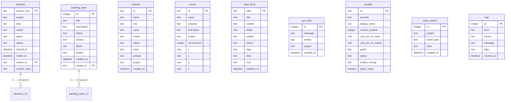
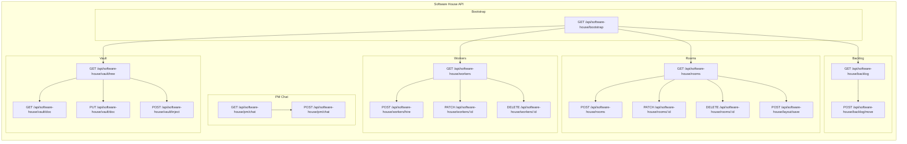
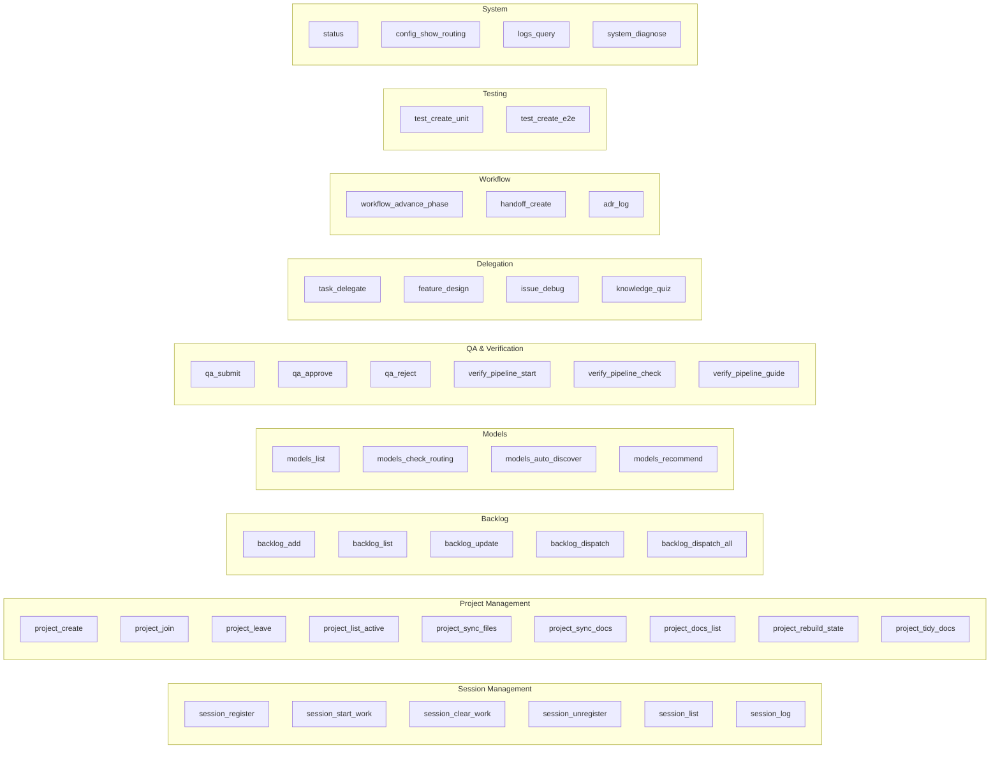
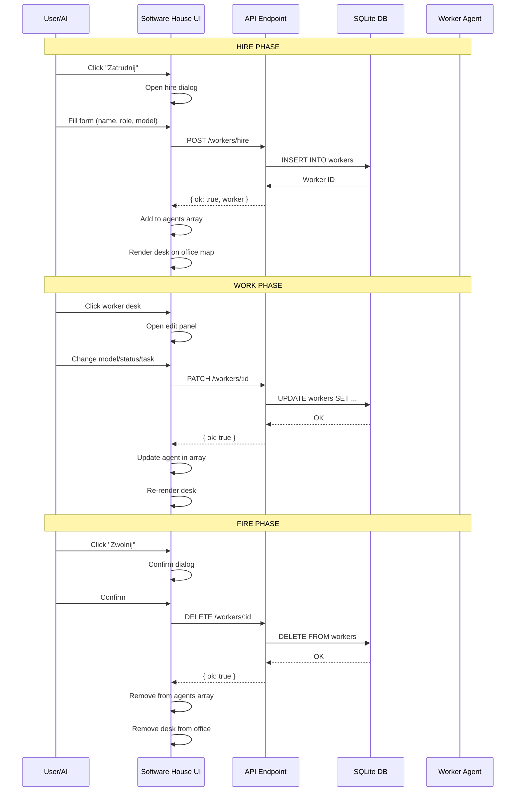
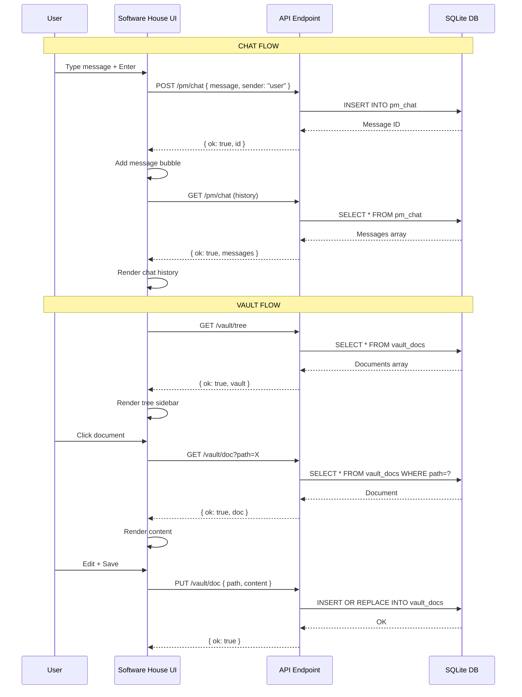
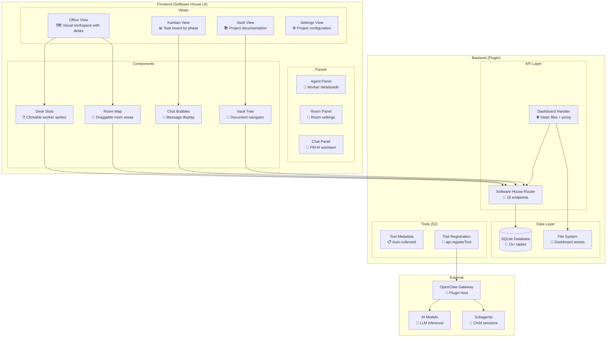
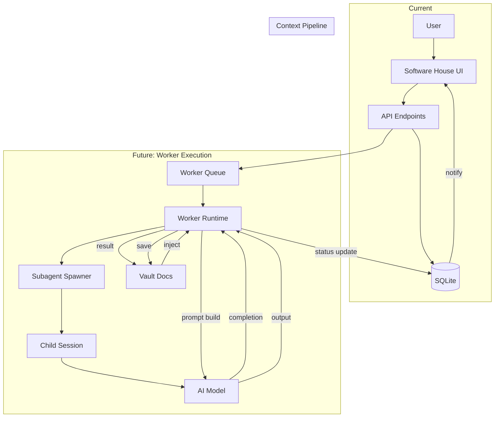

# Genor Orchestrator Plugin — Architecture

> Complete visual reference for the plugin's structure, data flow, and capabilities.

---

## 1. High-Level Architecture

```
┌─────────────────────────────────────────────────────────────────────────────┐
│                          OPENCLAW GATEWAY                                   │
│  ┌───────────────────────────────────────────────────────────────────────┐  │
│  │                     PLUGIN: genorch                                   │  │
│  │                                                                       │  │
│  │  ┌─────────────┐  ┌─────────────┐  ┌─────────────┐  ┌─────────────┐  │  │
│  │  │   index.ts   │  │   db.ts     │  │software-    │  │dashboard-   │  │  │
│  │  │  (main)      │  │ (database)  │  │house.ts     │  │handler.ts   │  │  │
│  │  │             │  │             │  │ (API)       │  │ (HTTP)      │  │  │
│  │  └──────┬──────┘  └──────┬──────┘  └──────┬──────┘  └──────┬──────┘  │  │
│  │         │                │                │                │          │  │
│  │         └────────────────┼────────────────┼────────────────┘          │  │
│  │                          │                │                           │  │
│  │                    ┌─────▼─────┐    ┌─────▼─────┐                     │  │
│  │                    │  SQLite   │    │  Static   │                     │  │
│  │                    │  Database │    │  Files    │                     │  │
│  │                    └───────────┘    └───────────┘                     │  │
│  └───────────────────────────────────────────────────────────────────────┘  │
│                                                                             │
│  ┌───────────────────────────────────────────────────────────────────────┐  │
│  │                     SOFTWARE HOUSE UI                                 │  │
│  │  ┌─────────┐  ┌─────────┐  ┌─────────┐  ┌─────────┐  ┌─────────┐    │  │
│  │  │ Office  │  │ Kanban  │  │  Vault  │  │  Chat   │  │ Settings│    │  │
│  │  │  View   │  │  Board  │  │  Docs   │  │  PM AI  │  │  Config │    │  │
│  │  └─────────┘  └─────────┘  └─────────┘  └─────────┘  └─────────┘    │  │
│  └───────────────────────────────────────────────────────────────────────┘  │
└─────────────────────────────────────────────────────────────────────────────┘
```

---

## 2. Database Schema



---

## 3. API Endpoints (Software House)



---

## 4. Registered Tools (52 total)



---

## 5. Data Flow: Worker Lifecycle



---

## 6. Data Flow: Chat & Vault



---

## 7. Worker Capabilities

### Current State: **Visual Management Only**

Workers in the Software House UI are **visual representations** with metadata:

| Capability | Status | Description |
|------------|--------|-------------|
| **Visual rendering** | ✅ Working | Sprites on office map with status indicators |
| **Metadata management** | ✅ Working | Name, role, model, status, room assignment |
| **Hire/Edit/Fire** | ✅ Working | Full CRUD via API to database |
| **Room assignment** | ✅ Working | Workers belong to rooms |
| **Status tracking** | ✅ Working | sleep/working/thinking/error states |
| **Task assignment** | ⚠️ Partial | Can assign task text, but no execution |
| **AI model selection** | ✅ Working | Each worker has a configured model |
| **Actual work execution** | ❌ Not implemented | Workers don't run tasks autonomously |
| **Subagent spawning** | ❌ Not connected | No link to OpenClaw subagent system |
| **Context injection** | ❌ Not connected | No link to vault docs for prompts |

### What Would Make Workers "Work"

To enable actual task execution, the plugin would need:

1. **Subagent Integration**: Connect worker → OpenClaw subagent session
2. **Task Queue**: Worker picks tasks from backlog, executes via subagent
3. **Context Pipeline**: Vault docs → worker prompt → subagent context
4. **Status Updates**: Subagent completion → worker status → UI update
5. **Result Capture**: Subagent output → backlog task status → vault doc

---

## 8. Component Architecture



---

## 9. Complete File Structure

```
genor-orchestrator-plugin/
├── src/
│   ├── index.ts              # Main plugin (52 tools, session management, hooks)
│   ├── db.ts                 # Database schema, migrations, helpers
│   ├── software-house.ts     # Software House API (18 endpoints)
│   ├── dashboard-handler.ts  # HTTP server, static files, proxy
│   └── shared.ts             # Shared utilities
│
├── dashboard/
│   ├── software-house.html   # Main UI (single-page app)
│   ├── data/
│   │   └── software-house-mock.json  # Mock data reference
│   └── assets/
│       └── pixel-agents/     # Worker sprites
│           ├── blue/
│           ├── orange/
│           ├── purple/
│           └── hacker/
│
├── docs/
│   ├── MERGER-PLAN.md        # Feature roadmap
│   └── ARCHITECTURE.md       # This file
│
├── dist/                     # Compiled JavaScript
├── orchestrator-data/        # Runtime data (models, projects)
└── package.json
```

---

## 10. Key Design Decisions

| Decision | Rationale |
|----------|-----------|
| **Single HTML file** | No build step, easy to edit, self-contained |
| **SQLite database** | Zero-config, portable, sufficient for plugin data |
| **Separate software-house.ts** | Isolates new feature, keeps index.ts manageable |
| **Mock-compatible API shape** | Frontend was built against mock JSON, API matches it |
| **Visual-first workers** | UI works immediately, execution can be added later |
| **Room-based organization** | Natural grouping for workers and tasks |
| **Vault as file system** | Familiar mental model, easy to extend |
| **PM Chat as AI interface** | Natural language control for orchestrator |

---

## 11. Future Architecture (When Workers Execute)



---

*Generated: 2026-06-24 | Version: 0.9.4 | Branch: feat/software-house-merger*
