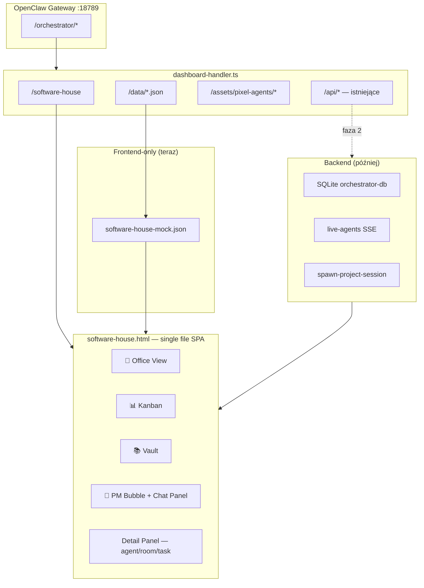
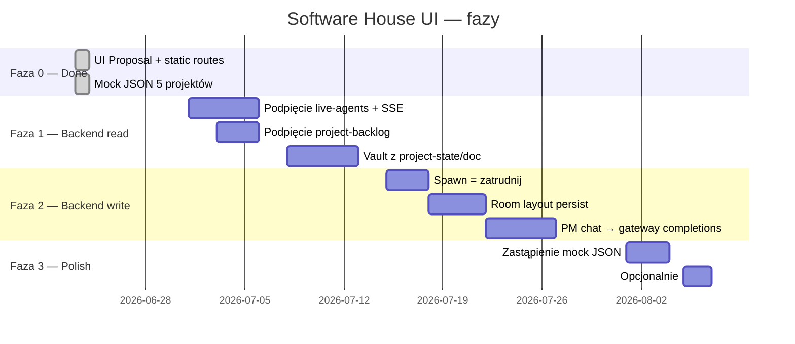

# Software House UI — Propozycja nowego interfejsu

> **Status:** UI Proposal · **Wersja mockupu:** v8 · **Branch:** `feat/software-house-ui-proposal`  
> **Filozofia:** Osobna trasa obok klasycznego GenoBoard — zero zmian w istniejącym dashboardzie poza linkiem „🏢 Software House”.

---

## Spis treści

1. [Co to jest i po co](#co-to-jest-i-po-co)
2. [Jak uruchomić lokalnie](#jak-uruchomić-lokalnie)
3. [Trasy HTTP (obecne i planowane)](#trasy-http-obecne-i-planowane)
4. [Struktura plików](#struktura-plików)
5. [Architektura widoku](#architektura-widoku)
6. [Funkcjonalności mockupu](#funkcjonalności-mockupu)
7. [Model danych (`software-house-mock.json`)](#model-danych-software-house-mockjson)
8. [Integracja z backendem — mapowanie API](#integracja-z-backendem--mapowanie-api)
9. [Nowe endpointy do zbudowania (backend)](#nowe-endpointy-do-zbudowania-backend)
10. [Pixel agents & sprite system](#pixel-agents--sprite-system)
11. [Przepływy użytkownika](#przepływy-użytkownika)
12. [Roadmapa: mock → produkcja](#roadmapa-mock--produkcja)
13. [FAQ / decyzje projektowe](#faq--decyzje-projektowe)

---

## Co to jest i po co

**Software House UI** to wizualna metafora software house’u dla orchestratora Genor:

| Klasyczny GenoBoard (`/orchestrator`) | Software House (`/orchestrator/software-house`) |
|----------------------------------------|--------------------------------------------------|
| Tabele, karty, logi, konfiguracja | Pixel-art biuro z programistami przy biurkach |
| Operator-first (dev/admin) | Project-first (PM + zespół agentów) |
| Dane live z SQLite / gateway | **Na razie mock JSON** — frontend-only |
| 9 zakładek SPA | 4 główne widoki: Biuro · Kanban · Vault · Ustawienia |

### Dlaczego osobna trasa?

- Nie psujemy stabilnego dashboardu produkcyjnego.
- Można iterować nad UX bez ryzyka regresji w `/orchestrator/api/*`.
- Product owner / stakeholder widzi „jak będzie wyglądać” bez czekania na pełny backend.
- Łatwy rollback: wyłącz link w headerze → nikt nie widzi propozycji.

### Wizja docelowa

Użytkownik wchodzi w **biuro projektu** → widzi pokoje (routing tasków) → programistów (sesje agentów) → klika PM (orchestrator) → planuje sprint → zatrudnia agentów → śledzi zadania na kanbanie → czyta kontekst w **vault** (jak Obsidian) wstrzykiwany do sesji przez plugin.

---

## Jak uruchomić lokalnie

### Przez gateway OpenClaw (zalecane)

```bash
npm run build
openclaw plugins install --force .
openclaw gateway restart   # wymagane po zmianie dashboard-handler.ts
```

| URL | Opis |
|-----|------|
| `http://127.0.0.1:18789/orchestrator/software-house` | Główny widok propozycji |
| `http://127.0.0.1:18789/orchestrator/` | Klasyczny dashboard (+ link „🏢 Software House”) |
| `http://127.0.0.1:18789/orchestrator/data/software-house-mock.json` | Mock danych |
| `http://127.0.0.1:18789/orchestrator/assets/pixel-agents/blue/static.png` | Sprite’y |

### Standalone (dev bez gateway)

```bash
cd /path/to/genor-orchestrator-plugin
python3 -m http.server 8877
# Otwórz: http://127.0.0.1:8877/MOCKUP-software-house.html
```

Mockup w root repo ładuje JSON z `dashboard/data/software-house-mock.json`.

---

## Trasy HTTP (obecne i planowane)

### ✅ Już zaimplementowane (statyczne)

Handler: `src/dashboard-handler.ts` → `createDashboardHandler()`

```
GET /orchestrator/software-house      → dashboard/software-house.html
GET /orchestrator/software-house.html → dashboard/software-house.html (via *.html rule)
GET /orchestrator/data/*              → dashboard/data/*
GET /orchestrator/assets/*            → dashboard/assets/*
```

### ✅ Istniejące API (używane przez klasyczny dashboard — do podpięcia)

| Endpoint | Metoda | Do czego w Software House |
|----------|--------|---------------------------|
| `/orchestrator/api/projects` | GET | Lista projektów w selektorze |
| `/orchestrator/api/live-agents` | GET | Statusy agentów na mapie biura |
| `/orchestrator/api/sse/live-sessions` | SSE | Live update stanów (working/sleep/error) |
| `/orchestrator/api/project-backlog` | GET | Kanban — kolumny backlog/in-progress/review/done |
| `/orchestrator/api/update-backlog-task` | POST | Przesunięcie taska między fazami |
| `/orchestrator/api/project-state` | GET/POST | Vault: `STATE.md` |
| `/orchestrator/api/project-doc` | GET/POST | Vault: pozostałe dokumenty projektu |
| `/orchestrator/api/spawn-project-session` | POST | Zatrudnienie / spawn nowej sesji agenta |
| `/orchestrator/api/config` | GET/POST | Ustawienia pokoi, routing presets |
| `/orchestrator/api/set-project-routing` | POST | Routing tasków per pokój |
| `/orchestrator/api/create-project` | POST | Nowy projekt |
| `/orchestrator/api/quick-action` | POST | PM quick actions (plan, status) |
| `/orchestrator/api/all` | GET | Bootstrap całego stanu (opcjonalnie jednym strzałem) |

### 🔜 Proponowane nowe endpointy (dedykowane dla Software House)

Te **nie istnieją jeszcze** — mock je symuluje lokalnie w JS. Backend team może je dodać w fazie integracji:

| Proponowany endpoint | Metoda | Opis |
|---------------------|--------|------|
| `/orchestrator/api/software-house/bootstrap` | GET | `{ projects, rooms, agents, tasks, vaultIndex }` — jeden payload jak mock JSON |
| `/orchestrator/api/software-house/rooms` | GET/PATCH | CRUD layoutu pokoi (x, y, w, h, layout, taskTypes) |
| `/orchestrator/api/software-house/agents` | GET/PATCH | Agenci z pozycją, sprite, room binding, status |
| `/orchestrator/api/software-house/pm/chat` | POST | Wiadomość do PM → odpowiedź orchestratora (streaming opcjonalnie) |
| `/orchestrator/api/software-house/vault/tree` | GET | Drzewo plików vault per projekt |
| `/orchestrator/api/software-house/vault/doc/:path` | GET/PUT | Odczyt/zapis dokumentu (markdown → HTML po stronie serwera lub klienta) |
| `/orchestrator/api/software-house/vault/inject` | POST | Wstrzyknięcie wybranego doc do aktywnej sesji (context injection) |

> **Uwaga:** Większość funkcji da się zrealizować **bez nowych endpointów** przez istniejące `/api/project-*`, `/api/live-agents`, `/api/spawn-project-session`. Nowe trasy to wygoda i mniejszy coupling frontendu.

---

## Struktura plików

```
genor-orchestrator-plugin/
├── MOCKUP-software-house.html          # Dev preview (root repo)
├── docs/
│   └── SOFTWARE-HOUSE-UI.md            # ← ten dokument
├── dashboard/
│   ├── software-house.html             # Produkcja: widok w gateway
│   ├── index.html                      # + link „🏢 Software House” w headerze
│   ├── data/
│   │   └── software-house-mock.json    # Mock: 5 projektów, agenci, vault
│   └── assets/
│       └── pixel-agents/
│           ├── blue/    (static.png + frames/0-8.png)
│           ├── orange/
│           ├── violet/
│           └── hacker/
├── assets/pixel-agents/                # Kopia dla MOCKUP root (local dev)
└── src/
    └── dashboard-handler.ts            # Routing /software-house + /assets + /data
```

### Co zmienia commit `81ff3b6`

| Zmiana | Pliki |
|--------|-------|
| Nowy widok UI | `dashboard/software-house.html` |
| Mock data | `dashboard/data/software-house-mock.json` |
| Sprite’y PNG | `dashboard/assets/pixel-agents/**` (+ `assets/` w root) |
| Routing HTTP | `src/dashboard-handler.ts`, `dist/dashboard-handler.js` |
| Link z klasycznego UI | `dashboard/index.html` (1 linia) |
| Dev mockup | `MOCKUP-software-house.html` |

**Nie zmienione:** `src/index.ts` (tools, hooks), logika pluginu, klasyczny dashboard SPA.

---

## Architektura widoku



### Layout ekranu (Office View)

```
┌─────────────────────────────────────────────────────────────────────────────┐
│ Header: logo · projekt · A−/A+ · Online · Plan · ← Klasyczny dashboard      │
├─────────────────────────────────────────────────────────────────────────────┤
│ PREVIEW banner: UI Proposal — frontend-only mock                            │
├──┬──────────────┬────────────────────────────────────────────┬────────────┤
│🏢│ Projekt      │  Office canvas (pan/zoom)                  │ 💬 Chat    │
│📊│ stats        │  ┌─ Command Center ─┐  ┌─ Backend Bay ─┐   │ orchestrator│
│📚│ pokoje       │  │  PM 🧠          │  │ Alex · Bob    │   │            │
│⚙️│ zatrudnij    │  └─────────────────┘  └───────────────┘   │            │
│  │              │  + PM bubble (po prawej od PM)            │            │
│  │ [Detail Panel│  desk-slot × N programistów                │            │
│  │  wysuwa się] │                                           │            │
└──┴──────────────┴────────────────────────────────────────────┴────────────┘
```

---

## Funkcjonalności mockupu

### 🏢 Widok biura (Office)

| Funkcja | Zachowanie | Backend (docelowo) |
|---------|------------|-------------------|
| **Pan / zoom** | Drag tła = przesuwanie; scroll = zoom; przyciski ±/Reset | — (pure UI) |
| **Pokoje (room-zone)** | Klik = panel pokoju + highlight; drag na tle = pan | `PATCH rooms` layout |
| **Edycja pokoi** | Toggle „✥ Edycja pokoi”: drag, resize E/S/SE, układ ▤▥⬚ | Persist layout per project |
| **Auto-fit pokoi** | Rozmiar z liczby agentów + layout (row/column/auto) | Obliczane client-side lub serwer |
| **Programiści (desk-slot)** | Klik = panel agenta; sprite animowany wg statusu | `live-agents` + SSE |
| **PM (orchestrator)** | Klik = **dymek czatu po prawej** (nie panel boczny) | PM chat endpoint |
| **+ Programista** | Modal zatrudnienia per pokój | `spawn-project-session` |
| **Room tabs** | Szybki focus kamery na pokój | — |

#### Stany wizualne agentów

| Status | Etykieta | Sprite | Animacja |
|--------|----------|--------|----------|
| `working` | Working | normal | ✅ frame loop |
| `reviewing` | Reviewing | normal | ✅ |
| `thinking` | Thinking | przyciemniony + dymki | ❌ |
| `sleep` | Sleep | przyciemniony + 💤 | ❌ |
| `error` | Error | sepia + shake + ERROR badge | ❌ |

### 🧠 PM Chat Bubble

Po kliknięciu Project Managera otwiera się **duży dymek po prawej stronie** biurka PM (400px, strzałka w lewo).

**Quick actions (przyciski):**

| Przycisk | Akcja mock | Docelowy backend |
|----------|------------|------------------|
| 📊 Status zespołu | Lista devów + statusy | `GET live-agents` |
| 📋 Zadania | Aktywne taski z backlogu | `GET project-backlog` |
| 🚧 Blokery | Agenci w stanie `error` | filtr na live-agents |
| 🗓️ Plan sprintu | Mock plan HTML | `POST quick-action` lub PM tool |
| ➕ Zatrudnij | Otwiera modal hire | `POST spawn-project-session` |
| 📚 Vault | Przełącza widok vault | nawigacja + `project-doc` |
| 📊 Kanban | Przełącza widok kanban | nawigacja + backlog |

Input w dymku + prawy panel „Chat z Orchestratorem” — oba zsynchronizowane (wiadomość usera trafia do obu).

### 📋 Detail Panel (wysuwany z lewej)

Tryby: `agent` | `room` | `task`

- **Agent:** status, model, pokój, sprite, task, prompt, lista tasków, zwolnienie
- **Pokój:** nazwa, kolor, purpose, routing tasków (chipy), lista devów, usuń pokój
- **Task:** faza, typ, agent, opis, link do pokoju/agenta

### 📊 Kanban (pełny widok)

Kolumny: Backlog · W toku · Review · Done  
Klik karty → detail panel taska.  
Dane z `tasks[]` w mock JSON (`phase`: `backlog` | `in-progress` | `review` | `done`).

### 📚 Vault (kontekst projektu — styl Obsidian)

Trójpanelowy układ:

1. **Sidebar** — drzewo folderów: Główne, docs/, decisions/, compliance/, experiments/, content/, sessions/
2. **Treść** — renderowany HTML z markdown (mock: pre-rendered `html` w JSON)
3. **Metadane** — status, data, tagi, backlinks, przycisk „Wstrzyknij do sesji” (mock toast)

Docelowo: pliki z `orchestrator-data/<project>/` + hooki `before_prompt_build` (context injection).

### ⚙️ Ustawienia + UX

- **A− / A+** — skala czcionki 90%–130%, zapis w `localStorage`
- **5 projektów demo** w selektorze (patrz JSON)
- **Proposal banner** — przypomina że to preview

---

## Model danych (`software-house-mock.json`)

```json
{
  "defaultProjectId": "genor-orchestrator-plugin",
  "projects": {
    "<project-id>": {
      "id": "string",
      "name": "string",
      "rooms": [ Room ],
      "agents": [ Agent ],
      "tasks": [ Task ],
      "vault": { "<path>": VaultDoc }
    }
  }
}
```

### Room

```typescript
interface Room {
  id: string;
  name: string;
  tag?: string;              // legacy — nie wyświetlany w UI
  color: string;             // hex — border + label
  purpose?: string;
  taskTypes: string[];       // dev | design | qa | review | devops | docs
  layout?: "auto" | "row" | "column";
  isCommand?: boolean;       // Command Center — tylko PM
  isOpenFloor?: boolean;     // overflow room
  x: number; y: number; w: number; h: number;  // layout canvas (0 = auto-fit)
}
```

### Agent

```typescript
interface Agent {
  id: string;
  name: string;
  role: string;
  sprite: "blue" | "orange" | "violet" | "hacker";
  model: string;
  status: "working" | "reviewing" | "sleep" | "thinking" | "error";
  task: string | null;
  progress: number;          // 0-100
  room: string;              // room.id
  isOrchestrator?: boolean;  // true = PM
  prompt: string;
  ctx: string;               // np. "42k/977k" token usage
}
```

### Task

```typescript
interface Task {
  id: string;
  title: string;
  desc: string;
  agent: string | null;      // agent.id
  phase: "backlog" | "in-progress" | "review" | "done";
  pri: "P0" | "P1" | "P2";
  type: string;              // maps to room.taskTypes routing
}
```

### VaultDoc

```typescript
interface VaultDoc {
  folder: string | null;     // null = root
  icon: string;
  title: string;
  updated: string;           // ISO date
  tags: string[];
  status: "active" | "stable" | "accepted" | "archive" | "draft";
  links: string[];           // inne ścieżki vault
  html: string;              // mock: pre-rendered; prod: markdown → HTML
}
```

### Projekty demo w mocku

| ID | Nazwa | Devs | Vault docs |
|----|-------|------|------------|
| `genor-orchestrator-plugin` | GenorBoard v2 | 8 (+ PM) | STATE, ROADMAP, ARCHITECTURE, ADR×2, handoff… |
| `api-gateway-svc` | API Gateway Service | 4 (+ PM) | STATE, ROADMAP, RUNBOOK |
| `fintech-mobile-app` | FinPay Mobile | 6 (+ PM) | STATE, PCI checklist, mobile arch |
| `ml-recommendation-engine` | RecoML Engine | 5 (+ PM) | STATE, experiment, data catalog |
| `docs-portal-redesign` | Docs Portal 3.0 | 3 (+ PM) | STATE, migration plan |

---

## Integracja z backendem — mapowanie API

Poniżej jak **podmienić mock** na live data — kolejność implementacji dla backend team.

### Faza 1 — Read-only (podgląd live)

```javascript
const API = (p, o) => fetch('/orchestrator' + p, { headers: { Accept: 'application/json' }, ...o }).then(r => r.json());

async function loadLiveBootstrap(projectId) {
  const [projects, agents, backlog, state] = await Promise.all([
    API('/api/projects'),
    API('/api/live-agents'),
    API(`/api/project-backlog?project=${projectId}`),
    API(`/api/project-state?project=${projectId}`),
  ]);
  // mapuj response → rooms, agents, tasks, vault
}
```

| Mock field | Źródło live |
|------------|-------------|
| `projects` | `GET /api/projects` |
| `agents[].status` | `GET /api/live-agents` (match session key / agent id) |
| `agents[].task` | backlog task assigned to session |
| `tasks[]` | `GET /api/project-backlog` |
| `vault['STATE.md']` | `GET /api/project-state` |
| `vault['docs/*']` | `GET /api/project-doc?path=...` |

### Faza 2 — Write actions

| Akcja UI | Endpoint |
|----------|----------|
| Zatrudnij programistę | `POST /api/spawn-project-session` |
| Zapisz agenta (model, room, prompt) | `PATCH` session config / nowy endpoint agents |
| Zapisz pokój (routing, nazwa) | `POST /api/set-project-routing` + room layout store |
| Przesuń task na kanbanie | `POST /api/update-backlog-task` |
| PM: plan / status | `POST /api/quick-action` |
| Vault: zapisz doc | `POST /api/project-doc` |
| Vault: inject context | tool `generate_handoff` / hook injection |

### Faza 3 — Real-time

```javascript
const es = new EventSource('/orchestrator/api/sse/live-sessions');
es.onmessage = (e) => {
  const update = JSON.parse(e.data);
  // update agent status on map without full re-render
};
```

Mapowanie SSE → `visualState(agent)`:

- session active + tool calls → `working`
- idle timeout → `sleep`
- error w safeguard log → `error`
- orchestrator session → `thinking`

---

## Nowe endpointy do zbudowania (backend)

Szczegółowy kontrakt proponowany dla `GET /api/software-house/bootstrap`:

```json
{
  "ok": true,
  "projectId": "genor-orchestrator-plugin",
  "project": {
    "id": "genor-orchestrator-plugin",
    "name": "GenorBoard v2"
  },
  "rooms": [ "..." ],
  "agents": [ "..." ],
  "tasks": [ "..." ],
  "vaultIndex": [
    { "path": "STATE.md", "title": "STATE", "folder": null, "updated": "2026-06-23", "tags": ["status"] }
  ]
}
```

Osobno `GET /api/software-house/vault/doc?project=X&path=STATE.md` — treść markdown.

**Persist layout pokoi** — nowa tabela lub JSON w project config:

```json
{
  "softwareHouseLayout": {
    "rooms": {
      "backend": { "x": 120, "y": 80, "w": 600, "h": 400, "layout": "row" }
    },
    "manualLayout": true
  }
}
```

---

## Pixel agents & sprite system

| Sprite | Pliki | Opis postaci |
|--------|-------|--------------|
| `blue` | `assets/pixel-agents/blue/` | Hoodie, jeden monitor |
| `orange` | `.../orange/` | Dual monitor, koszulka dev |
| `violet` | `.../violet/` | Laptop, purple hoodie |
| `hacker` | `.../hacker/` | Linux tower, słuchawki, terminal |

- **Static:** `static.png` — idle/sleep
- **Animacja:** `frames/0.png` … `frames/8.png` @ 8 FPS gdy `working` lub `reviewing`
- **Źródło:** generacja PixelLab MCP (referencja w commit message / assets)

Ścieżki w HTML:

```javascript
function staticPath(sprite) { return `assets/pixel-agents/${sprite}/static.png`; }
function spritePath(sprite, frame) { return `assets/pixel-agents/${sprite}/frames/${frame}.png`; }
```

Przy serwowaniu z gateway: `/orchestrator/assets/pixel-agents/...`

---

## Przepływy użytkownika

### 1. PM planuje sprint

```
Klik PM na mapie
  → Dymek czatu (prawa strona)
  → Quick: „🗓️ Plan sprintu” lub wpisz „plan”
  → [mock] HTML plan · [prod] quick-action / orchestrator tool
```

### 2. Zatrudnienie programisty

```
Klik „+ Programista” na pokoju LUB quick action w dymku PM
  → Modal: imię, rola, model, pokój, sprite, instrukcje
  → [mock] push do agents[] + toast
  → [prod] POST /api/spawn-project-session
  → auto-fit pokoju + focus na nowego agenta
```

### 3. Routing taska do pokoju

```
Task.type = "design"
  → roomForTaskType() szuka pokoju z taskTypes.includes("design")
  → Design Studio
Panel pokoju → chipy typów tasków (toggle)
  → [prod] POST /api/set-project-routing
```

### 4. Kontekst z vault

```
Sidebar 📚 → Vault
  → Klik STATE.md
  → Metadane + backlinks
  → „Wstrzyknij do sesji”
  → [prod] hook before_prompt_build + project-doc content
```

### 5. Przełączenie projektu

```
Selektor projektu (lewy panel)
  → loadProject(id) — zapisuje bieżący stan do catalog (mock)
  → [prod] przeładowanie bootstrap API per project
```

---

## Roadmapa: mock → produkcja



| Milestone | Kryterium ukończenia |
|-----------|---------------------|
| **M0 — Proposal** ✅ | Trasa działa, mock JSON, link z GenoBoard |
| **M1 — Live read** | Statusy agentów i kanban z API, bez mock JSON |
| **M2 — Live write** | Hire, save room, move task działają na backendzie |
| **M3 — Vault live** | STATE.md + docs z orchestrator-data, inject działa |
| **M4 — GA** | Feature flag; opcjonalnie merge do głównego UI |

---

## FAQ / decyzje projektowe

### Czy to zastępuje GenoBoard?

**Nie na razie.** To propozycja na osobnej trasie. Klasyczny dashboard zostaje źródłem prawdy dla operatorów.

### Dlaczego single-file HTML zamiast React/Vite?

- Spójność z `dashboard/index.html` (zero build step dla UI)
- Szybka iteracja mockupu
- Łatwy diff w PR
- W przyszłości można wydzielić komponenty lub przenieść do frameworka

### Dlaczego mock JSON zamiast od razu API?

Żeby frontend i UX mogły dojrzeć równolegle z backendem. Kontrakt danych w JSON **jest specyfikacją** dla backend team.

### Czy trzeba restartować gateway po zmianach?

| Zmiana | Restart? |
|--------|----------|
| `software-house.html`, JSON, PNG | ❌ Nie — wystarczy odświeżyć przeglądarkę |
| `dashboard-handler.ts` | ✅ Tak — `openclaw gateway restart` |
| `src/index.ts` (plugin core) | ✅ Tak |

### Gdzie plugin jest faktycznie ładowany?

Sprawdź `~/.openclaw/openclaw.json` → `plugins.entries.genorch`.  
Często wskazuje na `~/.openclaw/workspace/genor-orchestrator-plugin`, nie na `extensions/genorch`.

### Kto robi backend?

Ten dokument definiuje **kontrakt**. Implementacja: osobny task — mapowanie tabeli powyżej wystarczy jako ticket.

---

## Szybka ściąga dla developera

```bash
# Edytuj UI
vim dashboard/software-house.html

# Edytuj demo data
vim dashboard/data/software-house-mock.json

# Po zmianie handlera
npm run build && cp dist/dashboard-handler.js ~/.openclaw/workspace/genor-orchestrator-plugin/dist/
openclaw gateway restart

# Test tras
curl -s -o /dev/null -w "%{http_code}\n" http://127.0.0.1:18789/orchestrator/software-house
curl -s -o /dev/null -w "%{http_code}\n" http://127.0.0.1:18789/orchestrator/data/software-house-mock.json
```

---

*Dokument wygenerowany dla brancha `feat/software-house-ui-proposal` · commit `81ff3b6` · Genor Orchestrator Plugin*
